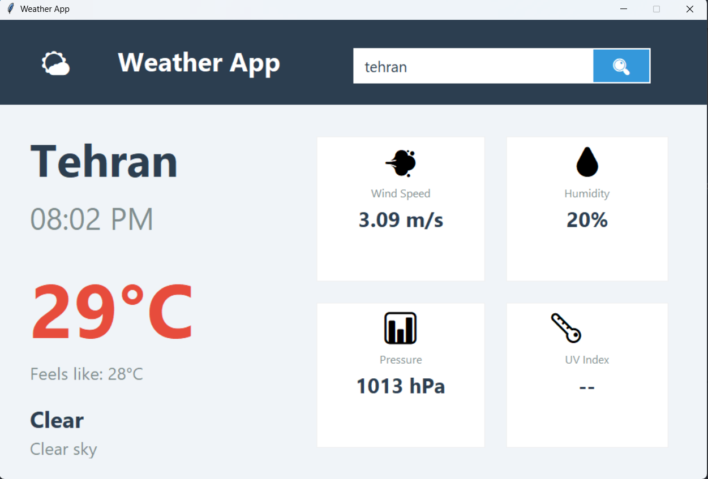

# 🌤️ Weather App

A modern and elegant weather application built with Python and Tkinter that provides real-time weather information for any city worldwide.


---
## Screenshots


---

## ✨ Features

- **Real-time Weather Data**: Get current temperature, humidity, wind speed, atmospheric pressure, and weather conditions
- **Local Time Display**: Automatically shows the exact local time of the selected city
- **"Feels Like" Temperature**: Displays the perceived temperature
- **Modern UI Design**: Clean glass-morphism interface with intuitive layout
- **Comprehensive Metrics**: All essential weather information at a glance
- **Smart Search**: Find any city worldwide with geocoding support
- **Keyboard Shortcut**: Press `Enter` to search instantly
- **Error Handling**: User-friendly error messages for invalid inputs or network issues
- **No Image Dependencies**: Uses Unicode icons for a lightweight and portable application

---

## 🚀 Technologies Used

- **Python 3.7+** - Core programming language
- **Tkinter** - GUI framework
- **OpenWeatherMap API** - Weather data provider
- **Geopy** - Geocoding services for city lookup
- **TimezoneFinder** - Timezone detection based on coordinates
- **Pytz** - Timezone handling and conversion
- **Requests** - HTTP requests for API calls

---

## 📦 Installation

### Prerequisites
- Python 3.7 or higher installed on your system
- pip (Python package manager)

### Step-by-Step Setup

1. **Clone the repository**
```bash
git clone https://github.com/yourusername/weather-app.git
cd weather-app

pip install -r requirements.txt

pip install geopy timezonefinder pytz requests

python weather_app.py
